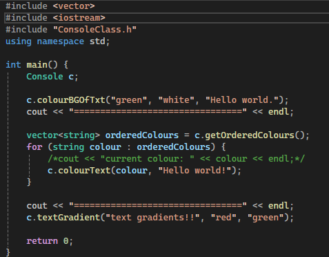
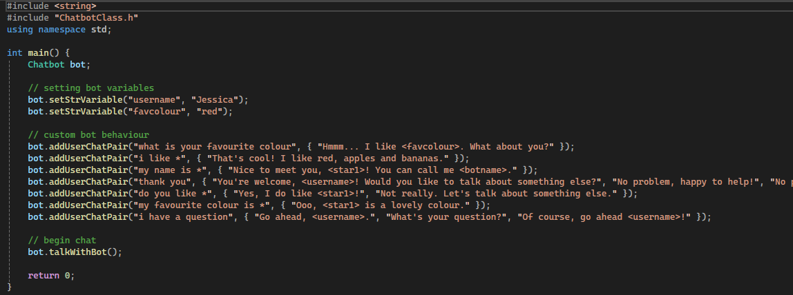

# C++ Libraries for your Convenience!
I've complied a handful of C++ classes for many issues you may face in your coding journey. Including:

- Better strings
- Dictionaries (inspired by Python)
- Console Styling

...and many more!

## How to Use
It's a simple process to get these classes up and running in your own code!
1. In VS2022 (or later), create a new empty C++ project.
2. On the right side of the IDE, a list of files can be seen, labelled "Header", "Resource", "Source". Take the `.h` file you wish to use and save it under "Header Files".
3. Create a `.cpp` file under "Source Files".
4. Ensure you write `#include "[header-file-name]"` before your `int main()` function.

## Usage Examples

### Example 1
A demonstration of the Console Styling class:

Output:

### Example 2
A demonstration of the Chatbot class:

Output:

## Creator's Portfolio
https://jessicadavies2003.github.io/
