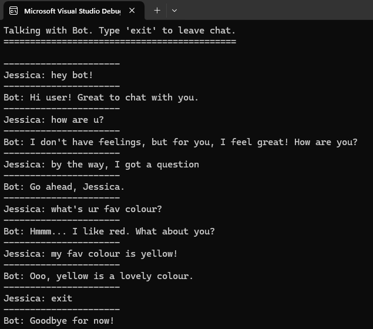

# C++ Libraries for your Convenience!
I've complied a handful of C++ classes for many issues you may face in your coding journey. Including:

- Better Strings
- Dictionaries (inspired by Python)
- Working with Time
- Console Styling

...and many more!

## How to Use
It's a simple process to get these classes up and running in your own code!
1. In VS2022 (or later), create a new empty C++ project.
2. On the right side of the IDE, a list of files can be seen, labelled "Header", "Resource", "Source". Take the `.h` file you wish to use and save it under "Header Files".
3. Create a `.cpp` file under "Source Files".
4. Ensure you write `#include "[header-file-name]"` before your `int main()` function.

## Usage Examples

### Example 1
A demonstration of the Console Styling class:

```
#include <vector>
#include <iostream>
#include "ConsoleClass.h"
using namespace std;

int main() {
	Console c;

    c.colourBGOfTxt("green", "white", "Hello world.");
    cout << "================================" << endl;

	vector<string> orderedColours = c.getOrderedColours();
	for (string colour : orderedColours) {
        /*cout << "current colour: " << colour << endl;*/
		c.colourText(colour, "Hello world!");
	}

    cout << "================================" << endl;
    c.textGradient("text gradients!!", "red", "green");

	return 0;
}
```

Output:


### Example 2
A demonstration of the Chatbot class:

```
#include <vector>
#include <string>
#include "ChatbotClass.h"
using namespace std;

int main() {
	Chatbot bot;

	// setting bot variables
	bot.setStrVariable("username", "Jessica");
	bot.setStrVariable("favcolour", "red");

	// custom bot behaviour
	bot.addUserChatPair("what is your favourite colour", { "Hmmm... I like <favcolour>. What about you?" });
	bot.addUserChatPair("i like *", { "That's cool! I like red, apples and bananas." });
	bot.addUserChatPair("my name is *", { "Nice to meet you, <star1>! You can call me <botname>." });
	bot.addUserChatPair("thank you", { "You're welcome, <username>! Would you like to talk about something else?", "No problem, happy to help!", "No problem, is there anything else I can help with, <username>?" });
	bot.addUserChatPair("do you like *", { "Yes, I do like <star1>!", "Not really. Let's talk about something else." });
	bot.addUserChatPair("my favourite colour is *", { "Ooo, <star1> is a lovely colour." });
	bot.addUserChatPair("i have a question", { "Go ahead, <username>.", "What's your question?", "Of course, go ahead <username>!" });

	// begin chat
	bot.talkWithBot();

	return 0;
}
```

Output:



## Issues
If you have any feedback regarding these classes, there are many ways to submit it.

- Via Email.
- Via the Issues section of this repository.

Find which one you'd prefer and get your feedback heard!

## Creator's Portfolio
https://jessicadavies2003.github.io/
